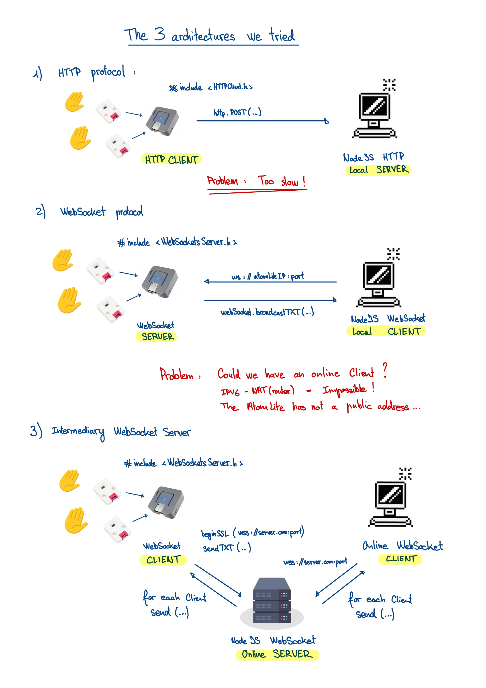

# In this project...

This project was made for the University of Fribourg. <br> 
It is an implementation of a Theremin with an M5Stack Atom Lite and 2 Ultrasonic Distance sensors. <br>
This branch was made to test different architectures for the project...

## Global Installation

1. Clone the repository of the project from GitLab:  
   `$ git clone git@gitlab.switch.ch:sop/2024/kaptori3n.git`

2. You can see the available branches with:  
   `$ git branch -a`

3. Move to the Architectures branch:  
   `$ git checkout Architectures`

4. Make sure you have Node and NPM installed: [Node.js Website](https://nodejs.org/en)

## Requirements

- M5 Atom Lite
- 2 x Ultrasonic Distance Unit I2C (RCWL-9620)
- I2C Hub 1 to 6 Expansion Unit (PCA9548APW)
- Connect the 2 sensors to channels 0 and 1 of the expansion unit
- Connect the expansion unit to the Atom Lite

# HTTP-Local

In this architecture, the Atom Lite sends data to a local server via the HTTP protocol.

- The Atom Lite is an HTTP client
- The JavaScript script runs a local HTTP server on your computer

You have to connect your Computer and your Atom Lite to the same wifi...

## Installation

```
├── HTTP-Local
│   ├── JS-HTTP-Server
│   │   ├── app.js
│   │   ├── node_modules
│   │   ├── package-lock.json
│   │   └── package.json
│   └── M5-HTTP-Client-2Sensors
│       ├── M5-HTTP-Client-2Sensors.ino
│       ├── linkedQueue.cpp
│       └── linkedQueue.h
```

### For the Atom Lite

1. Open the file **M5-HTTP-Client-2Sensors.ino**
2. Modify the following lines with your wifi credentials and the IP address of your computer :

```c
// WiFI Settings
const char* ssid = "...";
const char* password = "...";

// Server Settings
const char* serverAddress = "...";
```

3. Flash your Atom Lite

### For your Computer

4. In your terminal, move to the **JS-HTTP-Server** folder
5. Make sure you have all dependencies installed : <br>
   `$ npm install`
6. Start the server<br>
   `$ npm run start`

Now you can see the distances logged into your terminal !

# WS-M5Server-Local

In this folder, the Atom Lite is a local websocket server which broadcasts data to clients.

- The Atom Lite is a local websocket server
- The JavaScript script runs a local websocket client

You have to connect your Computer and your Atom Lite to the same wifi...

## Installation

```
├── WS-M5Server-Local
│   ├── JS-WS-Client
│   │   ├── app.js
│   │   ├── node_modules
│   │   ├── package-lock.json
│   │   └── package.json
│   └── M5-WS-Server-2Sensors
│       ├── M5-WS-Server-2Sensors.ino
│       ├── linkedQueue.cpp
│       └── linkedQueue.h
```

### For the Atom Lite

1. Open the file **M5-WS-Server-2Sensors.ino**
2. Modify the following lines with your wifi credentials :

```c
// Wifi setup
const char *ssid = "...";
const char *password = "...";
```

3. Flash your Atom Lite
4. You can find the **IP Address of the Atom Lite** printed into the serial

### For you Computer

4. Open the file **app.js**
5. Modify the stars in the following line with the **IP Address of the Atom Lite** <br>

```js
// **********************************************
// WebSocket setup
// **********************************************

const ws = new WebSocket("ws://*******ATOM_IP*******:81");
```

6. In your terminal, move to the **JS-WS-Client** folder
7. Make sure you have all dependencies installed : <br>
   `$ npm install`
8. Start the server<br>
   `$ npm run start`

Now you can see the distances logged into your terminal !

# WS-SSLServer

In this folder, you can find the code used for a secure Websocket transmission (https standard).

- Atom Lite is a Websocket Client
- JS execute a Websocket Server secure with SSL, online with Heroku
- Angular PWA app play sound, online with Firebase

The Atom Lite sends data to the Heroku server, which broadcast to all clients. <br>

## Installation

```
├── WS-SSLServer
│   ├── AngularClientPWA-Token
│   │   └── angular-pwa-client-sop
│   ├── JS-WS-Server
│   │   ├── Procfile
│   │   ├── package-lock.json
│   │   ├── package.json
│   │   └── server.js
│   └── M5-WS-Client-2Sensors
│       └── M5-WS-Client-2Sensors.ino
```

### For the JS-WS-Server folder

- This folder contains the complete code ready for deployment on [Heroku](https://www.heroku.com/)
- If you are interested to deploy your own, you can create an account : **Hosting on Heroku isn't free !**
- Once you have created an account, you can now create a project
- To deploy the code, you can install [the heroku cli](https://devcenter.heroku.com/articles/heroku-cli)
- You can now open a terminal, move to **JS-WS-Server** folder and follow these steps : <br>
  (you can also go to the online heroku dashboard to see these commands)

```
    $ heroku login
    $ Heroku git:clone -a your-project-name
    $ cd your-project-name
    $ git add .
    $ git commit -am “make it better”
    $ git push heroku master
```

- **This websocket server can accept clients only if they provide a token**, you can see it in **server.js** file :

```js
// ***** FIELDS AND INIT *****

const WebSocket = require("ws");
const port = process.env.PORT || 8080;
const authToken = process.env.AUTH_TOKEN;
```

- The token required is setup as an environment variable inside the online heroku dashbard, **Don't forget to setup yours !**

### For the Atom Lite

1. Open the file **M5-WS-Client-2Sensors.ino**
2. Modify the following lines with your wifi credentials, the IP address of your online server and the token :

```c
// Wifi setup
const char *ssid = "...";
const char *password = "...";

// Websocket
WebSocketsClient webSocket;
const char *authToken = "...";
const char *websocketUrl = "...";
const int websocketPort = 443;
```

3. Flash your Atom Lite

### For the AngularClientPWA-Token folder

- This folder contains the code of a Progressive Web App made with the framework [Angular](https://angular.dev/)
- This application is hosted on [Firebase](https://firebase.google.com/) and available at this address : https://atomlitesop.web.app/home
- If you are interested to deploy your own, you can create an account : **Hosting on Firebase is free until a certain usage**
- Once you have created an account, you can create a project
- To deploy the code, you can install [the angular cli](https://angular.io/cli)
- You can now open a terminal, move to **angular-pwa-client-sop** folder and follow these steps : <br>
  (you can also go to the online firebase dashboard to see these commands)

```
$ ng build						            // Build our app
$ sudo npm install -g firebase-tools 		// Upgrade auto
$ firebase login
$ firebase init
    - Hosting : Configure files for Firebase Hosting and (optionally) set up GitHub Actions…
    - Use an existing project created on Firebase...
    - Public folder : dist/angular-pwa-client-sop/browser		// Must contains index.html
    - NO for rewrite all index.html
    - No for GitHub…
$ firebase deploy
```

Now you can listen the sound or see the live distances with the application ! 

# Architectures overview


